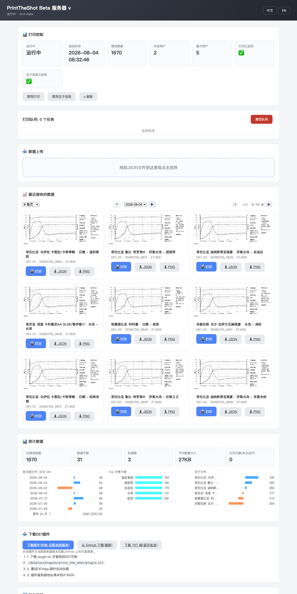

# PrintTheShot Beta

> ⚠️ **测试状态说明**:本项目仅完成了软件层面的开发与模拟数据测试,**尚未连接真实 DECENT 咖啡机(DE1)与热敏打印机进行实机验证**。上传端点的数据格式基于真实 DE1 导出的 JSON,打印链路沿用原版的 lpr/CUPS 方案,但实机打印效果与插件交互仍需真机确认。



DECENT 咖啡机冲泡数据打印服务器的**轻量重构版**。兼容原版(DecentEspressoPrintTheShot)的插件、上传端点和管理界面,但:

- ✅ **只依赖 Pillow**——去掉 matplotlib / numpy,图表用 PIL 直绘
- ✅ **内置 Noto Sans CJK 中文字体**——跨平台输出一致,无需系统字体
- ✅ **打包更小更快**——PyInstaller 产物 ~30MB(v1.6 约 80MB),启动 ~0.3s
- ✅ **Web 管理界面改为独立模板**(`web/index.html`)
- ✅ **GitHub Actions 三平台自动构建**——发 tag 即出 Windows/macOS/Linux 二进制
- ✅ 修复原版缺陷:空 `by_weight` 数组导致图表生成崩溃;同秒上传文件名撞车

## 快速开始

```bash
# 源码运行(仅需 pillow)
pip install -r scripts/requirements.txt
python print_the_shot_server.py            # 默认端口 8000
python print_the_shot_server.py --port 9000
```

打开 `http://localhost:8000` 使用管理界面。DE1 插件配置服务器地址为本机 IP:8000 即可(插件与 v1.6 完全兼容,见 `plugin/plugin.tcl`)。

## 仅渲染测试(不启动服务器)

```bash
python print_the_shot_server.py --render shot.json out.png
# 同时生成 out_print.bmp(打印用二值图)
```

样例数据在 `sample_shots/`。

## 打包(单文件可执行)

| 平台 | 命令 |
|---|---|
| macOS | `./scripts/build_macos.sh` → `dist/PrintTheShot` + `.app` |
| Linux | `./scripts/build_linux.sh` → `dist/PrintTheShot` |
| Windows | `scripts\build_windows.bat` → `dist\PrintTheShot.exe` |

打 tag `vX.Y.Z` 推送到 GitHub 即触发 [GitHub Actions](.github/workflows/build.yml) 三平台自动构建,产物挂到 Release。

## 打印

- **macOS/Linux**: 走 `lpr`/`lp`(CUPS),需配置 80mm 热敏打印机,纸张 `Custom.80x180mm`
- **Windows**: 纯 ctypes 调用系统打印 API(无 pywin32 依赖),使用系统默认打印机

## 目录结构

```
print_the_shot_server.py    # 主程序(HTTP + 渲染 + 打印)
web/index.html          # 管理界面模板({{LANG}}/{{VERSION}} 占位)
fonts/                  # 内置字体(Noto Sans CJK SC, SIL OFL)
plugin/plugin.tcl       # DE1 插件(与 v1.6 相同)
scripts/                # 打包脚本 + PyInstaller spec
sample_shots/           # 测试数据
.github/workflows/      # 三平台 CI
```

## API(与原版兼容)

- `POST /upload?machine_id=...` — JSON 或 multipart 上传,自动渲染+打印
- `GET /api/status` `/api/shots` `/api/queue` `/api/settings` `/api/language`
- `POST /api/print` `/api/language` `/api/settings/beaninfo` `/api/settings/print`
- `DELETE /api/queue`
- `GET /images/*.png` `/plugin/plugin.tcl` `/download/json/*`

## 许可

与 v1.6 相同(GPLv3);内置字体 Noto Sans CJK 为 SIL Open Font License 1.1,可自由再分发。
