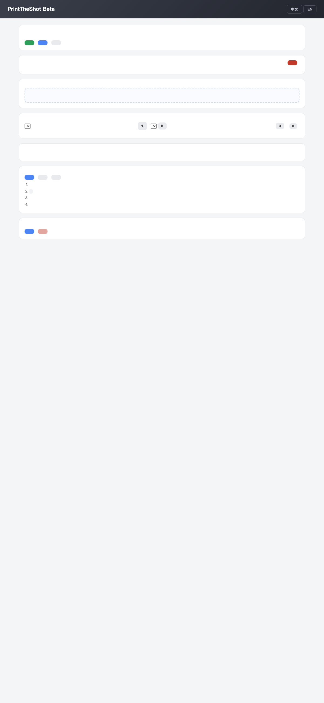
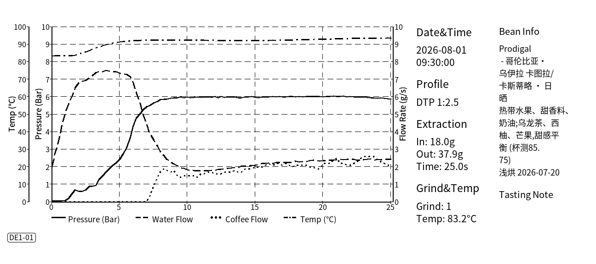

# PrintTheShot Beta

[中文文档](README_zh.md) | English

> ⚠️ **Test Status**: This project is complete at the software level and tested with simulated data, but has **NOT yet been verified against a real DECENT espresso machine (DE1) and thermal receipt printer**. The upload data format is based on real DE1-exported JSON, and the print pipeline reuses the original lpr/CUPS approach — but real-machine printing and plugin interaction still need hardware confirmation.

## Screenshots

**Web UI**



**Printed output** (simulated data, PNG)



---

A lightweight rework of the DECENT espresso shot printing server. Compatible with the original project's (DecentEspressoPrintTheShot) plugin, upload endpoint, and management UI.

## Feature Comparison (Beta vs v1.6)

| Feature | v1.6 | Beta |
|---|---|---|
| Dependencies | matplotlib + numpy + pillow | **pillow only** |
| CJK font | System-dependent (often missing) | **Bundled Noto Sans CJK** (consistent everywhere) |
| Package size | ~80MB | ~30MB |
| Startup time | ~2.5s (matplotlib import) | ~0.3s |
| Web UI | Inline HTML strings | **Standalone template, EN/中文 bilingual** |
| History | Lost on restart | **Persisted (index.json), survives restarts** |
| Data browsing | Flat list | **Date filter + prev/next day + pagination (9/18/36)** |
| Statistics | None | **3-column: date / brew profile / bean distribution** |
| Large view / downloads | None | **Click thumbnail for large view; JSON/PNG downloads** |
| Plugin distribution | Single download | **Local + GitHub + TXT (for Bluetooth)** |
| Online update | None | **Self-update with auto backup** |
| 3-platform packaging | Manual | **GitHub Actions automated** |
| Known bug fixes | Empty `by_weight` crash; same-second filename collision | Fixed |

## Quick Start

```bash
# Run from source (pillow only)
pip install -r scripts/requirements.txt
python print_the_shot_server.py            # default port 8000
```

Open `http://localhost:8000` for the management UI.

## Web UI Guide

- **Status card**: running state, shots received, print toggle, bean-info toggle
- **Recent data**: shows today's shots by default; supports
  - Date dropdown + ◀ ▶ prev/next day navigation
  - Page size 9 / 18 / 36 per page (remembered), paginated browsing
  - Click a thumbnail for the **large view**; each card offers **print / download JSON / download PNG**
  - Card title = `bean - brew profile`
- **Statistics** (one row, three columns):
  - By date: diverging bars around the daily average (blue = above, orange = below)
  - Brew profile distribution, bean distribution
- **Upload**: drag & drop a JSON file to trigger render + print manually
- **Plugin section**: local version (matches this server) / GitHub latest / **TXT version** (Android often rejects `.tcl` over Bluetooth — `tcl.txt` transfers fine)
- **Service update**: check for updates → update from GitHub (auto-backup to `backup/`)

## End-to-End Deployment (DE1 → print)

1. Start the server and note your machine's IP (shown in the startup banner)
2. Download the plugin from the **plugin section** of the web UI (`plugin.tcl` or the TXT version renamed)
3. Copy it to the DE1 tablet's SD card: `/de1plus/plugins/print_the_shot/plugin.tcl`
4. Restart DE1App, go to Settings → Plugins → Print The Shot, configure:
   - Server URL: `your-computer-ip:8000` (e.g. `192.168.1.100:8000`)
   - Server endpoint: `upload`
   - Use HTTP: enabled
5. Shots upload automatically after brewing → chart renders → auto-print

## Render-Only Testing (no server)

```bash
python print_the_shot_server.py --render shot.json out.png
# also produces out_print.bmp (1-bit image for printing)
```

Sample data is in `sample_shots/`. Generate a month (~1670 shots) of simulated data:

```bash
python scripts/generate_test_data.py 31 50   # days  shots-per-day
```

## Update Mechanism

- **Check updates**: Web UI → Service Update card → Check; compares local vs remote version
- **Update from GitHub**: downloads the repo ZIP → validates content → **auto-backs up the old version to `backup/<timestamp>/`** → replaces server/web template/plugin → **restart the server to apply**
- Packaged builds can't self-update (code is inside the executable) — download the new installer from GitHub Releases

## Packaging (single-file executables)

| Platform | Command |
|---|---|
| macOS | `./scripts/build_macos.sh` → `dist/PrintTheShot` + `.app` + zip |
| Linux | `./scripts/build_linux.sh` → `dist/PrintTheShot` |
| Windows | `scripts\build_windows.bat` → `dist\PrintTheShot.exe` |

**Recommended**: push a tag — Actions builds all three platforms and attaches them to Releases:

```bash
git tag v2.0-beta.1 && git push origin v2.0-beta.1
```

GitHub Actions is **completely free for public repositories** — no local packaging or distribution needed.

Release assets (auto-generated per tag):

| File | Platform | Notes |
|---|---|---|
| `PrintTheShot-linux` | Linux | run from terminal |
| `PrintTheShot-macos.zip` | macOS | unzip → `PrintTheShot.app`, double-click to run |
| `PrintTheShot-windows-x64.exe` | Windows | double-click to run |

> CI pipeline: `.github/workflows/build.yml`; full troubleshooting history and release checklist in [docs/CI.md](docs/CI.md). Key points: Windows builds must use `python -m pip`; build failures are surfaced explicitly; Release assets are named per platform and never overwrite each other.

## CLI Options

| Flag | Description |
|---|---|
| `--port N` | Listen port (default 8000) |
| `--render json [png]` | Render a chart only, without starting the server |
| `--no-print` | Disable auto-print on startup |

## Directory Layout

```
print_the_shot_server.py    # main program (HTTP + render + print + update)
web/index.html              # web UI template ({{LANG}}/{{VERSION}} placeholders)
fonts/                      # bundled font (Noto Sans CJK SC, SIL OFL)
plugin/plugin.tcl           # DE1 plugin (compatible with v1.6)
scripts/                    # build scripts + PyInstaller spec + test-data generator
sample_shots/               # sample data
screenshots/                # doc screenshots
.github/workflows/          # 3-platform CI
shots_data/                 # runtime: uploaded JSON + index.json (history index)
shots_images/               # runtime: chart PNGs
backup/                     # runtime: pre-update backups
```

## API

| Method | Path | Description |
|---|---|---|
| POST | `/upload?machine_id=...` | JSON/multipart upload, auto render + print |
| GET | `/api/status` | server status |
| GET | `/api/shots[?date=YYYY-MM-DD]` | shot list (filtered by date), includes available dates |
| GET | `/api/stats` | statistics (totals/date/profile/bean distribution) |
| GET | `/api/queue` | print queue |
| GET | `/api/settings` `/api/language` | settings & language |
| POST | `/api/print` | manual print `{filename}` |
| POST | `/api/settings/beaninfo` `/api/settings/print` | toggle bean info / printing |
| POST | `/api/language` | switch language |
| DELETE | `/api/queue` | clear queue |
| GET | `/images/*.png` `/download/json/*` | image & JSON downloads |
| GET | `/plugin/plugin.tcl` `/plugin/plugin.tcl.txt` | plugin download (TXT for Bluetooth) |
| GET | `/api/update/check` | check for updates |
| POST | `/api/update` `/api/plugin/update` | update service / plugin |

## Printing

- **macOS/Linux**: via `lpr`/`lp` (CUPS); requires an 80mm thermal printer configured with paper `Custom.80x180mm`
- **Windows**: pure ctypes system print API (no pywin32), uses the default printer

## Troubleshooting

| Symptom | Fix |
|---|---|
| Chart not generated | Check `shots_data/` for uploaded JSON; the log shows errors |
| Print does nothing | `echo test \| lp` to verify CUPS; confirm paper is 80x180mm |
| History missing | Check `shots_data/index.json` exists (written after each upload) |
| Update has no effect | Updates require **restarting the server** |
| Port in use | Use `--port` to change it |
| Blank web page | Hard refresh (Cmd+Shift+R); check the console (F12) |

## License

GPLv3 (same as v1.6); the bundled Noto Sans CJK font is SIL Open Font License 1.1 — freely redistributable.
